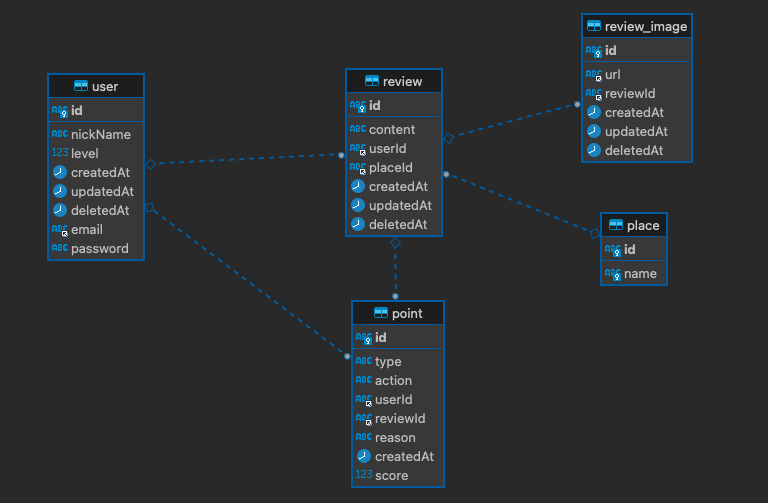

# _트리플 여행자클럽 마일리지 서비스_


> 트리플 사용자가 리뷰를 작성할때
> 포인트를 부여하며, 전체/개인에대한 포인트 히스토리와
> 개인별 누적 포인트를 관리하는 서비스

<hr>

## 🛠 사용한 기술

> - TypeScript
> - Node.js
>   - Nest.js
>     - (API Statement Library) Swagger
> - MySQL
>   - TypeORM
> - Docker
>   - Docker-Compose

<hr>

## 🔮 Git Commit 컨벤션

|    TAG     |   DESCRIPTION    |
| :--------: | :--------------: |
|  **Feat**  |     기능추가     |
|  **Fix**   | 작은 규모의 수정 |
| **Modify** |  큰 규모의 수정  |

<hr>

## 📚 실행 방법

```
git clone https://github.com/SJY0917032/Triple-Travelers-Club.git

cd Triple-Travelers-Club/triple

docker-compose build
docker-compose up

Swagger 접속
http://localhost:3000/api-docs

시나리오
1. 유저생성 /user POST
2. 장소생성 /place POST
3. 리뷰작성 /review POST
4. 이벤트 /events POST
5. 포인트 증가,차감 완료
```

<hr>

> **❗️❗️❗️기본적으로 서버실행후 Swagger를 통해 확인이 가능합니다.❗️❗️❗️**

## API 항목

### 🚶🏻 User

|   METHOD   |                URL                 |      PARAMETER       | RETURN  |            DESCRIPTION             |
| :--------: | :--------------------------------: | :------------------: | :-----: | :--------------------------------: |
|  **GET**   |     http://localhost:3000/user     |                      | User[ ] |      유저를 전체 조회합니다.       |
|  **POST**  |     http://localhost:3000/user     |    CreateUserDto     |  User   |         유저를 생성합니다          |
| **PATCH**  | http://localhost:3000/user/{email} | email, UpdateUserDto |  User   | 이메일로 조회한 유저를 수정합니다. |
| **DELETE** | http://localhost:3000/user/{email} |        email         |  User   | 이메일로 조회한 유저를 삭제합니다. |

<hr>

### 🗺 Place

|  METHOD  |                URL                 |   PARAMETER    |  RETURN  |         DESCRIPTION         |
| :------: | :--------------------------------: | :------------: | :------: | :-------------------------: |
| **GET**  |    http://localhost:3000/place     |                | Place[ ] |   장소를 전체 조회합니다.   |
| **POST** |    http://localhost:3000/place     | CreatePlaceDto |  Place   |      장소를 생성합니다      |
| **GET**  | http://localhost:3000/place/{name} |      name      |  Place   | 장소를 이름으로 조회합니다. |

<hr>

### 📋 Review

|   METHOD   |                   URL                    |         PARAMETER         |  RETURN   |                      DESCRIPTION                      |
| :--------: | :--------------------------------------: | :-----------------------: | :-------: | :---------------------------------------------------: |
|  **POST**  |      http://localhost:3000/review/       |      CreateReviewDto      | EventDto  | 리뷰를 생성하고, POST /events에 보낼 객체를 받습니다. |
|  **GET**   |      http://localhost:3000/review/       |                           | Review[ ] |                리뷰를 전체 조회합니다.                |
| **PATCH**  | http://localhost:3000/review/{reviewId}  | reviewId, UpdateReviewDto | EventDto  | 리뷰를 수정하고, POST /events에 보낼 객체를 받습니다. |
| **DELETE** | http://localhost:3000/review/{reviewId}  |         reviewId          | EventDto  | 리뷰를 삭제하고, POST /events에 보낼 객체를 받습니다. |
|  **GET**   | http://localhost:3000/review/{reviewId}  |         reviewId          |  Review   |                리뷰를 단일 조회합니다.                |
|  **GET**   | http://localhost:3000/review/me/{userId} |          userId           | Review[ ] |         유저가 작성한 모든 리뷰를 조회합니다.         |

<hr>

### 💰 Point

| METHOD  |                    URL                     | PARAMETER |    RETURN    |                DESCRIPTION                 |
| :-----: | :----------------------------------------: | :-------: | :----------: | :----------------------------------------: |
| **GET** | http://localhost:3000/point/total/{userId} |  userId   | UserPointDto |   해당 유저의 포인트 총합을 조회합니다.    |
| **GET** |    http://localhost:3000/point/{userId}    |  userId   |   Point[ ]   |   유저의 전체 포인트 기록을 조회합니다.    |
| **GET** |        http://localhost:3000/point         |           |   Point[ ]   | 모든 유저의 전체 포인트 기록을 조회합니다. |

<hr>

### 🎯 Event

|  METHOD  |             URL              | PARAMETER |          RETURN          |                            DESCRIPTION                            |
| :------: | :--------------------------: | :-------: | :----------------------: | :---------------------------------------------------------------: |
| **POST** | http://localhost:3000/events | EventDto  | Point[] or Point or void | EventDto의 Action에 따라 유저에게 포인트를 부여하거나 차감합니다. |

<hr>

### 💾 File

|  METHOD  |                 URL                 | PARAMETER | RETURN |              DESCRIPTION               |
| :------: | :---------------------------------: | :-------: | :----: | :------------------------------------: |
| **POST** |   http://localhost:3000/uploads/    |   File    |  Url   |          파일을 업로드합니다           |
| **GET**  | http://localhost:3000/uploads/{url} |    Url    |  File  | 업로드된 주소의 URL의 파일을 읽습니다. |

## ERD



```

```

```

```
